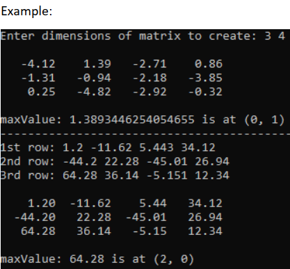

# Exercise Definition
#### Due: March 3th, 2022 until 12pm
### In this exercise you are required to complete given java file with your own code.

- Complete the makeMatrix method that generates a 2D matrix with random values
between -5 and 5 according to given integer row and column count and returns it.
- Complete the getMatrix method that reads a 2D matrix row-by-row from user according
  to given integer row and column count and returns it. While reading each row, you must
  print which row you are reading (e.g, 1st row:, 2nd row:..). Remember that while
  eleventh is written as 11th, twenty-first is written as 21st and so on. Write your code
  according to this.
- Complete the printMatrix method that prints the given matrix, each row in a newline
  and each value with only two decimal places and their width set to eight.
- Complete the locateMax method that returns the location of the largest element in
  given matrix. The return value is an instance of Location.
- Design a class named Location that contains public data fields row, column and
  maxValue. Row and column data fields are the indices of largest element in the matrix
  and maxValue is that element.

- Write your own code. Edit the java file you are given. Change the file name to
  Ex01_YourStudentNumber.java (e.g. Ex01_202051056016.java). Remember, public class’s
  name must be the same with your file name.

